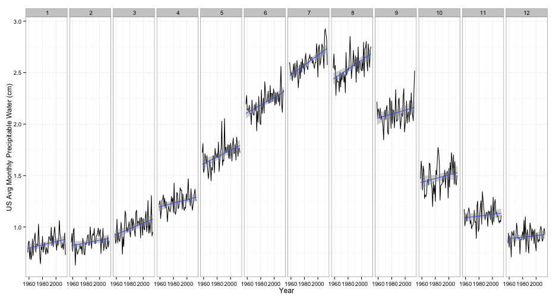
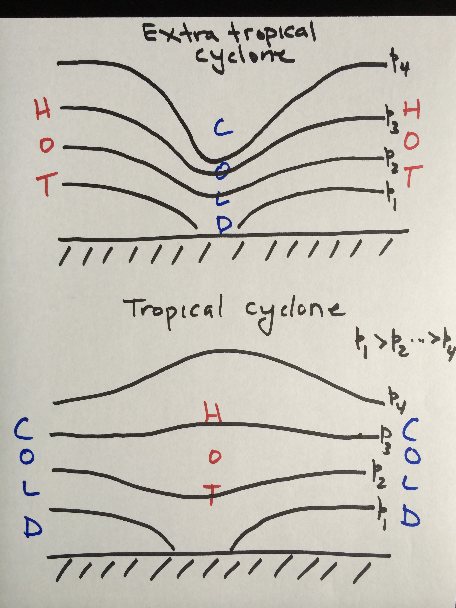
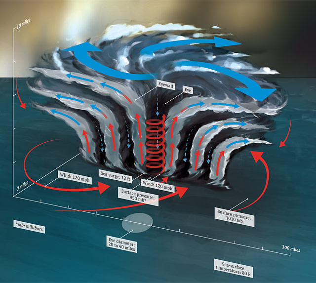
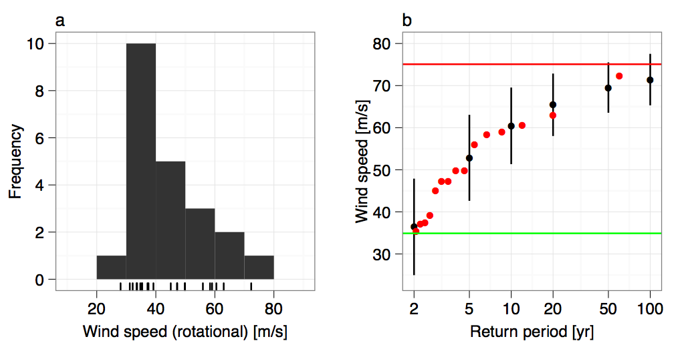

Hurricanes are warm on the inside
=================================

=====


=====


```r
L = "http://myweb.fsu.edu/jelsner/PW_US.txt"
df = read.table(L, header = TRUE)
head(df)
```

```
  Month Year     AvgPW MoA        PW
1     1 1958 0.2967896 Jan 0.7538455
2     1 1959 0.3323898 Jan 0.8442700
3     1 1960 0.3399212 Jan 0.8633999
4     1 1961 0.2716433 Jan 0.6899740
5     1 1962 0.3123702 Jan 0.7934204
6     1 1963 0.2687994 Jan 0.6827505
```

======

```r
library(ggplot2)
ggplot(df, aes(x = Year, y = PW)) +
  geom_line() +
  geom_smooth(method = lm) +
  facet_wrap(~ Month, nrow = 1) +
  ylab("US Avg Monthly Precipitable Water (cm)") +
  theme_bw()
```

 

Slower jetstream
================

* Slower moving jet stream together with more moisture (water vapor) increases the chance for heavy rainfall. 

* The atmosphere’s ability to hold water (recall: saturation vapor pressure vs temp) increases by about 4 percent for every 1°F increase in temperature

* [Heavy precipitation fact sheet WRI](http://www.wri.org/sites/default/files/WRI14_Factsheets_Heavy_Precipitation.pdf)

* 1-in-100 year event. Return periods versus annual probability.

Cold vs warm core storms
========================



Inside a hurricane
=========



Maximum potential intensity
===========================

$$
\hbox{MPI} \sim \frac{\hbox{SST}}{T_o}\hbox{BL}_{f}(\hbox{SST})
$$

MPI (maximum potential intensity) is the highest wind speed (rotational) in units of meters per second.

SST is the ocean temperature at the surface, $T_o$ is the temperature at the top of the hurricane and BL$_{f}$(SST) is the heat flux near the ocean surface. The heat flux depends on SST.

Extreme value theory (EVT) is a statistical theory that estimates the risk of extreme, rare events.

=====

Suppose we record the highest wind speed (m s$^{-1}$) from 10 consecutive hurricanes.

* 34.5, 44.2, 57.5, 33.8, 67.8, 38.2, 41.5, 71.2, 61.0, 49.1

We order the values from lowest to highest.

* 33.8, 34.5, 38.2, 41.5, 44.2, 49.1, 57.5, 61.0, *67.8*, *71.2*

This tells us that 20% of the hurricanes have winds that exceed 61 m s$^{-1}$ and 10% have winds that exceed 67.8 m s$^{-1}$. EVT uses these quantile wind speeds to work out a theoretical highest possible wind speed, which we will call the **limiting intensity (LI)**.

=====

