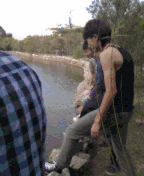

Week 1
======

GEO 4930-02: Special Topics in Geography: **Climate Change & Storms**, Online: Spring 2016

Instructor: Professor James B. Elsner, Department of Geography (http://geography.fsu.edu)

Mentors: Tyler Fricker, Erik Fraza, Holly Widen

Will global warming lead to more violent storms?

Compelling Evidence Climate Is Changing
=======================================

* Sea levels are rising and the oceans are becoming more acidic.

* Temperatures are increasing and glaciers are melting.

* Weather events are becoming more extreme.

* Focus will be on hurricanes and tornadoes. 
  + How are they changing. 
  + Why?

* Storms are my passion. If it spins, it wins.

Goal
====
I will give you a better understanding of the science behind global warming as it relates to storminess.

I will focus on severe weather: in particular hurricanes and tornadoes. How are they changing? Changes in extreme weather, such as heat waves, droughts, storms, are the way that many people experience climate change. 

I will teach you the basics of weather and climate and I will challenge you to think critically about how and why tornadoes and hurricanes might be changing as the climate warms.

Objectives
==========
Name the important components of the climate system.

Summarize the pattern of results in a climate change graph without making inappropriate inferences.

Summarize and compare the ten climate change indicators.

List and explain the ingredients for tornadoes & hurricanes.

Explain why scientists think hurricanes/tornadoes might be more numerous and stronger as the globe continues to warm.

Grades
======

Ten quizzes: multiple choice, TRUE/FALSE

Reading Materials
=================

Lecture Notes: On Blackboard > Course Library 

Viewable on your smartphone.

My Passions
===========
My passion for storms began as a kid growing up in Milwaukee wishing for a "snow day."  

Freedom from school. Pushing cars for cash. I was keen to understand what the nightly weather forecasters were saying.

Forecasting is hard and humbling (sometimes humiliating): the bus.

Every spring I get an itch to chase tornadoes across the Great Plains.

[Chase 2011](https://www.youtube.com/watch?v=rHj2_USLnxA&list=UUmvKrcWTnNGjoy9OTGTz1qQ)

My Passions
===========
Doing science. Teaching students how to become scientists. Teaching students how to think, write, and code. Code is the grammar of data.

*''The goal is to provide analytical tools that will last students a lifetime.''*---Edward Tufte

[Is coding the new literacy?](http://www.motherjones.com/media/2014/06/computer-science-programming-code-diversity-sexism-education)

Quiz schedule
=============
**Thursday January 28th**

**Thursday February 25th**

**Thursday April 7th**

No makeup quizzes.

Broad Ideas
===========
Meteorology vs geography: Calculus vs statistics. 

A challenge in teaching students about climate is to get them over the elitism of the calculus. Statistics is as important, even more so.

Did global warming cause that terrible tornado? Did it make it more likely? Did global warming make this hurricane season more active?

There is a systematic increase in tornado width and length during the past 20 years. Tornado size is correlated with intensity.

Feedback
========
[Poll Everywhere](http://www.polleverywhere.com/)

Important Dates
===============
* 

Topics
======
* The Climate System
* Global Warming & Climate Change
* Hurricanes & Climate Change
* Extra-tropical Cyclones and Climate Change
* Tornadoes & Climate Change

Academic Honor System
=====================
Students are expected to uphold the [Academic Honor Code](http://www.eng.fsu.edu/~peterson/fsuhc.html) published in The Florida State University Bulletin and the Student Handbook. 

The Academic Honor System of The Florida State University is based on the premise that each student has the responsibility (1) to uphold the highest standards of academic integrity in the student's own work, (2) to refuse to tolerate violations of academic integrity in the university community, and (3) to foster a high sense of integrity and social responsibility on the part of the university community.

Americans With Disabilities Act
===============================
Students with disabilities needing academic accommodation should: (1) register with and provide documentation to the Student Disability Resource Center; (2) bring a letter indicating the need for accommodation and what type.  This should be done during the first week of classes.

Grading Standards
=================
Grade | Score | Standard
------|-------|---------
A     | 93-100| Outstanding: Few if any errors/omissions
B     | 85-93 | Good: Only minor errors/omissions
C     | 75-85 | Satisfactory: Minor omissions, a few major
D     | 65-75 | Poor: Several major errors/omissions
F     | < 65  | Fail: Many major errors/omissions

I'll use pluses and minuses on the grades so for example a 93 could be an A- or a B+, etc.

Politics of Climate Change and Storms
============================================

[Obama Storms CC](http://www.sho.com/sho/video/titles/31271/president-obama)

How can we know anything about the climate of hurricanes and tornadoes? Weather is so unpredictable?

[Adrift (4.5 min)](http://vimeo.com/simonchristen/)

[Warming planet](https://youtu.be/oX3w5z2onvU)
