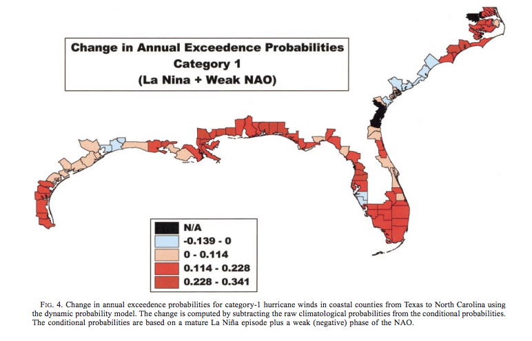
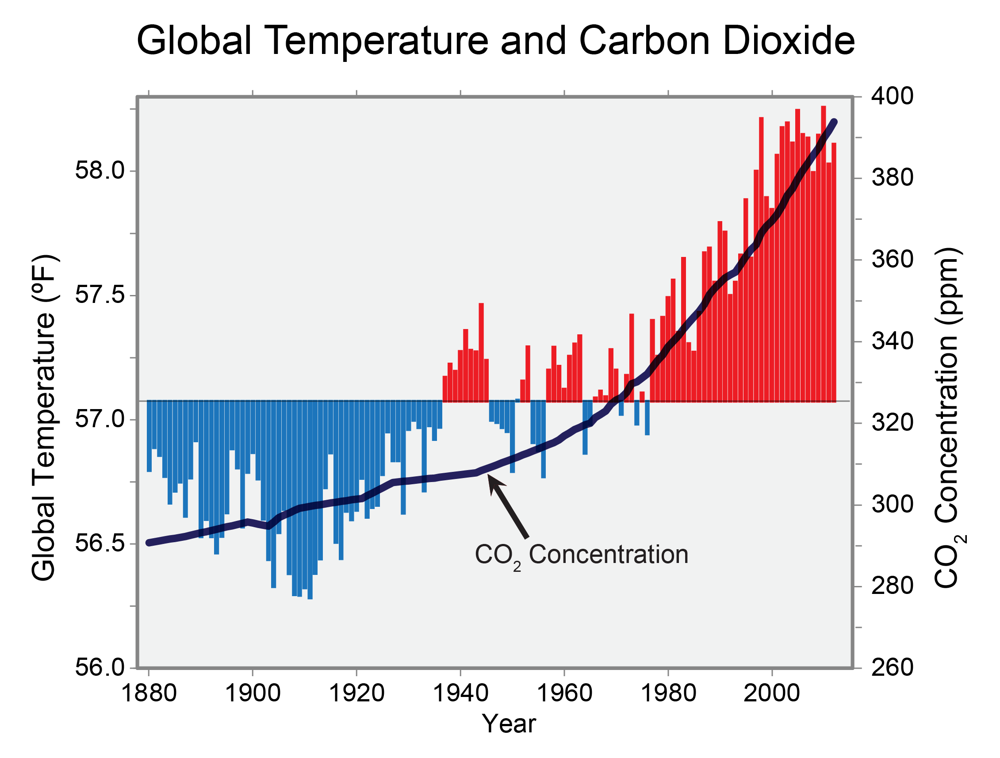

<style type="text/css">
.small-code pre code {
font-size: 1.3em;
}
</style>

Climate Change: 2
=====================

Weather vs climate, heat balance, Keeling curve, how to make a graph.

Grades
======

Activity | Percentage
---------|-----------
Term project | 30%
Exams (3 + Final) | 70%


**Term project** plot a time series of some climate record, estimate the trend line, and interpret the results. 

**Exams** multiple choice, True/False

### Readings

Notes are written using markdown language in RStudio and coverted to HTML. They should be available on your smartphone.

Last Time
=========

Exam schedule, repreducibility

[Poll Everywhere](http://www.polleverywhere.com/)

Climate change: hurricanes & tornadoes edition.

Additional reading: [Climate change and snowstorms](http://www.livescience.com/47579-snowstorm-intensity-global-warming.html)

Climate & Weather
=================

Climate, weather, and climatology

Climate vs climatology

Climate as an adjective
+ climate variability: the fluctuations in *expected* weather
+ climate change: climate variability over many decades to centuries
+ hurricane climate variability example

Chance of a Hurricane
=====================
[My research](http://myweb.fsu.edu/jelsner/PDF/Research/JaggerElsnerNiu2001.pdf)

Dynamic probability model


=====



Energy Balance
==============

A simple climate model. Energy input equals energy output.

Good approximation, but not exact. The atmosphere contains gases that trap some of the heat and move it around.

One of the gases is carbon dioxide.

[Keeling's curve](https://www.youtube.com/watch?v=0Z8g-smE2sk) [3.5 min]


Let's look at the data
======================
Temperature and CO$_2$



[Observed Changes](http://nca2014.globalchange.gov/report/our-changing-climate/observed-change#tab2-images)

=======

Figure 2.2: Global Temperature and Carbon Dioxide > Details/Downloads > Images > Metadata > https://www.ncdc.noaa.gov/ersst/merge.php > ASCII Time Series

ftp://ftp.ncdc.noaa.gov/pub/data/mlost/operational/products

Analysis of Climate Data
========================

Modern climate analysis must be done on a computer. But there is a choice: spreadsheet or programming language. 

I believe learning how to program is an essential skill for environmental scientists.

While convenient, a spreadsheet is ultimately limiting and restricts three properties essential for good data analysis: 

*Reproducibility*, 

*Communication*, 

*Automation*.

Reproducibility
===============

If a climate analysis is to be a convincing scientific artefact, the trail from raw data to final output must be available to everyone.

It's difficult to do this with a spreadsheet. It's way too easy for mistakes to arise (e.g., assuming you sorted the entire table rather than just a single column).

A scientific paper describing the result of an investigation is advertisement for a specific claim. But 'proof' is the procedure that was used to obtain the result. The code is the message.

Communication
=============

Computer code is the grammar for communication. Not just to the computer but to your future self and to other scientists. 

It is difficult to communicate how to use a spreadsheet. Click here, then right click here, then choose menu X, etc. 

Code is easy to communicate because all important information is simple text.

Automation
==========

If you've made a map with GIS you know the difficulty in recreating it for a new dataset.

This happens often in climatology since data are updated with each new day, month, season, etc. 

Moreover, during data preparation and exploration you are likely to find problems that require fixing.

Running a script of code with new data is trivial.

Use R & RStudio
===============

[R Project for Statistical Computing](http://www.r-project.org/)

[RStudio](http://www.rstudio.com/products/rstudio/)

This is what I use. And I do a lot of research [Elsner's Research](http://myweb.fsu.edu/jelsner/Research.html)

How Fast is the Earth Warming?
==============================

Get temperature data


```
Error in file(file, "rt") : 
  cannot open the connection to 'ftp://ftp.ncdc.noaa.gov/pub/data/mlost/operational/products/aravg.ann.land.00N.90N.v3.5.4.201407.asc'
```
