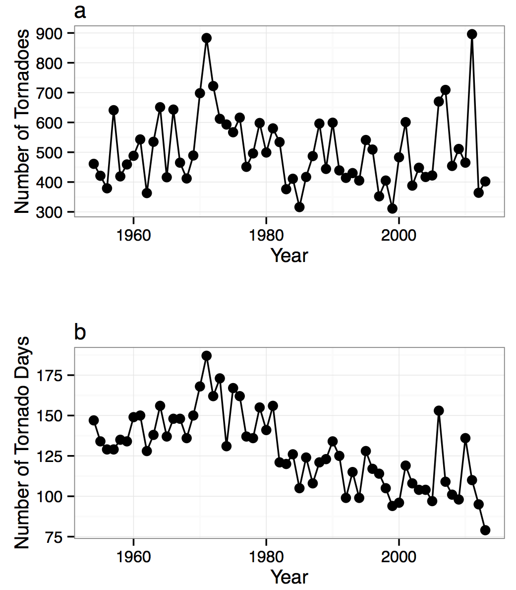
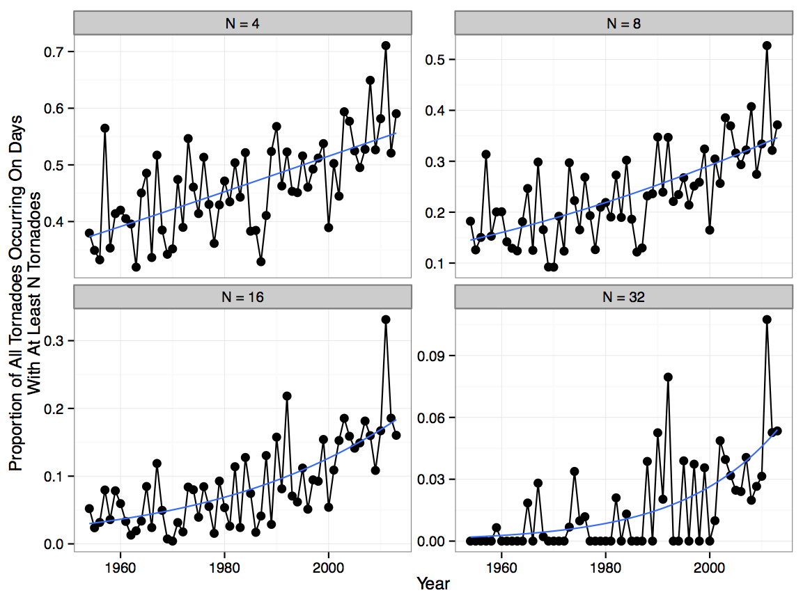
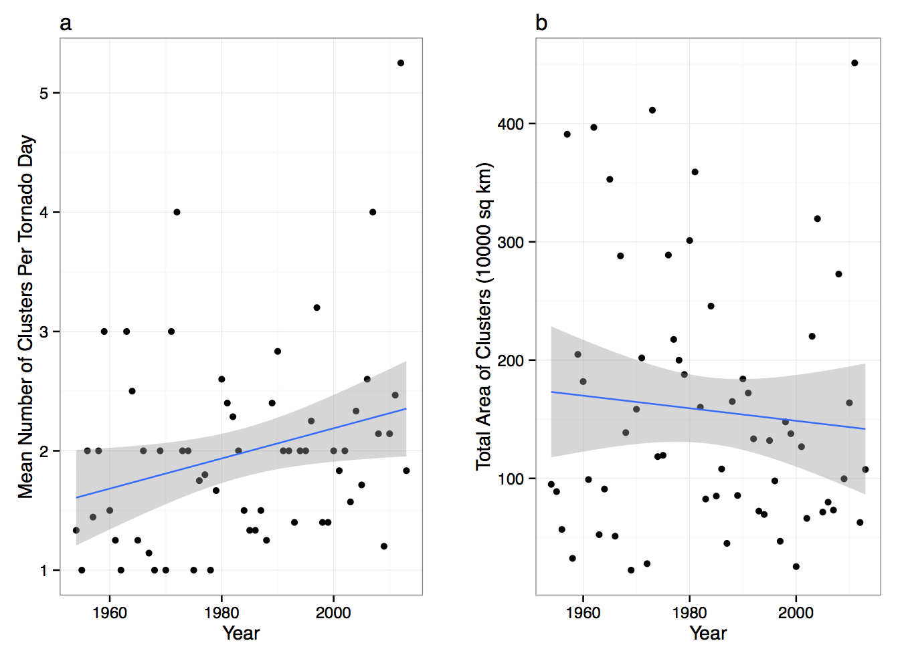
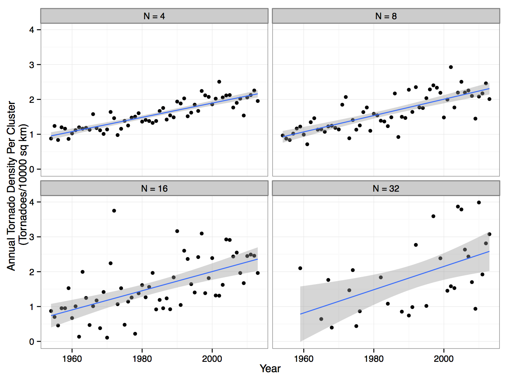
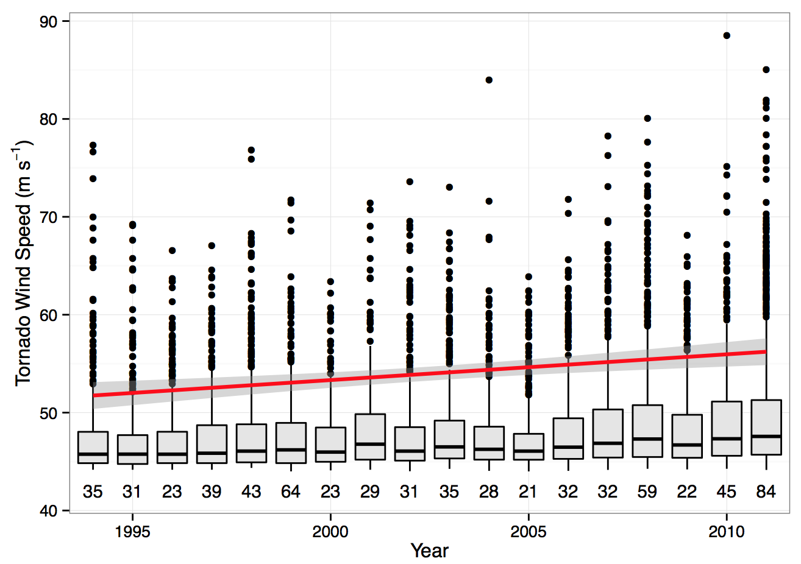

Tornado Changes
===============

In this final week of class we examine the evidence for changes in tornado activity.

* The atmosphere seems to becoming more efficient at making tornadoes. So when conditions are right more tornadoes occur.

* It also appears that tornadoes might be getting stronger.

Research on this topic is new.

====

====

Tornado clusters
================

Not more or bigger clusters
===========================

====

====
[Pilger NE Twin Tornadoes 2014](https://www.youtube.com/watch?v=V9d7DDQawVE)

Are tornadoes getting stronger?
===============================
[Moore video from the ground](https://www.youtube.com/watch?v=cJTorIDx6TE)

Problem
=======

* An estimate of how strong a tornado might get in the future requires a continuous scale of intensity.
* The EF damage scale is categorical.
* We can count the number of tornadoes by EF category.
* But a plot of the number of tornadoes by EF category does not answer the question: Are tornadoes getting stronger?

If we solve this problem, then

=====

=====

Studying the damage left behind is the most reliable way to estimate tornado strength. 

But there are other ways. Let's listen to Ian.
[Measuring tornado intensity using blender](https://youtu.be/IoSkpvrT-c8)

[Chasing the chasers](https://vimeo.com/89534573)

